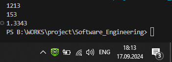

# Тема 2. Базовые операции языка Python
Отчет по Теме #2 выполнил(а):
- Бойков Егор Сергеевич
- ИВТ-22-1

| Задание | Лаб_раб | Сам_раб |
| ------ | ------ | ------ |
| Задание 1 | + | + |
| Задание 2 | + | + |
| Задание 3 | + | + |
| Задание 4 | + | + |
| Задание 5 | + | + |
| Задание 6 | + | + |
| Задание 7 | + | + |
| Задание 8 | + | + |
| Задание 9 | + | + |
| Задание 10 | + | + |

знак "+" - задание выполнено; знак "-" - задание не выполнено;

Работу проверили:
- к.э.н., доцент Панов М.А.
## Лабораторная работа №1
### Выведите в консоль три строки. Первая – любое число. Вторая – любое число в виде строки. Третья – любое число с плавающей точкой.

''' python 
print(1213)
print("153")
print(1.3343)
'''
### Результаты 

## Выводы

## Общие выводы по теме
-  Таким образом git  это мощная система управления версиями, которая позволяет разработчикам эффективно отслеживать изменения в коде, работать совместно над проектами и восстанавливать предыдущие версии при необходимости. Она поддерживает ветвление для параллельной разработки, что упрощает внедрение новых функций и исправление ошибок. Благодаря возможности работы оффлайн и интеграции с популярными платформами хостингами, такими как GitHub и GitLab, Git обеспечивает высокую гибкость и масштабируемость, а его широкая поддержка в сообществе делают его стандартом в мире разработки ПО.
