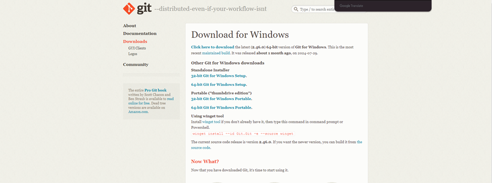

# Тема 1. Введение в Python
Отчет по Теме #1 выполнил(а):
- Бойков Егор Сергеевич
- ИВТ-22-1

| Задание    | Лаб_раб |
| ---------- | ------- |
| Задание 1  | +       |
| Задание 2  | +       |
| Задание 3  | +       |
| Задание 4  | +       |
| Задание 5  | +       |
| Задание 6  | +       |
| Задание 7  | +       |
| Задание 8  | +       |
| Задание 9  | +       |
| Задание 10 | +       |
| Задание 11 | +       |
| Задание 12 | +       |
| Задание 13 | +       |
| Задание 14 | +       |
| Задание 14 | +       |

знак "+" - задание выполнено; знак "-" - задание не выполнено;

Работу проверили:
- к.э.н., доцент Панов М.А.

## Лабораторная работа №1
###  Установка

## Лабораторная работа №2
###  Настройка

![[Pasted image 20240910222053.png]]
## Лабораторная работа №3
###  Создание нового репозитория
![[Pasted image 20240910222246.png]]
## Лабораторная работа №4
### Подготовка файлов
![[Pasted image 20240910222246.png]]
## Лабораторная работа №5
### Фиксация изменений
![[Pasted image 20240910222406.png]]
## Лабораторная работа №6
### Подключение к удаленному репозиторию
![[Pasted image 20240910222601.png]]
![[Pasted image 20240910222615.png]]
![[Pasted image 20240910222632.png]]
![[Pasted image 20240910222751.png]]
## Лабораторная работа №7
### Ветвление
![[Pasted image 20240910222928.png]]
![[Pasted image 20240910222939.png]]
![[Pasted image 20240910223031.png]]

## Лабораторная работа №8
### Особенности применения "Фетч"
![[Pasted image 20240910223122.png]]
## Лабораторная работа №9
### Удаление файлов, веток, локальных и удалённых репозиториев
![[Pasted image 20240910223204.png]]
![[Pasted image 20240910223211.png]]
![[Pasted image 20240910223220.png]]
![[Pasted image 20240910223225.png]]

## Лабораторная работа №10
### Отслеживание изменений в коммитах
![[Pasted image 20240910223716.png]]
## Лабораторная работа №11
### Возвращение файла к предыдущему (определенному) состоянию
![[Pasted image 20240910224405.png]]
## Лабораторная работа №12
### Возвращение к предыдущему коммиту
![[Pasted image 20240910224910.png]]
## Лабораторная работа №13
### Исправление коммита
![[Pasted image 20240910231332.png]]

## Лабораторная работа №14
### Разрешение конфликтов при слиянии
![[Pasted image 20240910232426.png]]
## Лабораторная работа №15
###  Настройка .gitignore
![[Pasted image 20240910233131.png]]

## Общие выводы по теме
-  Таким образом git  это мощная система управления версиями, которая позволяет разработчикам эффективно отслеживать изменения в коде, работать совместно над проектами и восстанавливать предыдущие версии при необходимости. Она поддерживает ветвление для параллельной разработки, что упрощает внедрение новых функций и исправление ошибок. Благодаря возможности работы оффлайн и интеграции с популярными платформами, такими как GitHub и GitLab, Git обеспечивает высокую гибкость и масштабируемость, а его открытый исходный код и широкая поддержка в сообществе делают его стандартом в мире разработки ПО.
