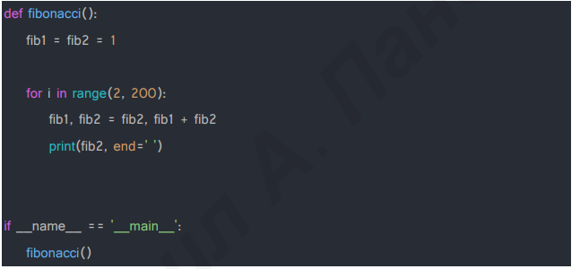

# Тема 10. Декораторы и исключения
Отчет по Теме #10 выполнил(а):
- Бойков Егор Сергеевич
- ИВТ-22-1

| Задание | Лаб_раб | Сам_раб |
| ------ | ------ | ------ |
| Задание 1 | + | + |
| Задание 2 | + | + |
| Задание 3 | + | + |
| Задание 4 | + | + |
| Задание 5 | + | + |

знак "+" - задание выполнено; знак "-" - задание не выполнено;

Работу проверили:
- к.э.н., доцент Панов М.А.

## Лабораторная работа №1
### Наверняка вы думаете, что декораторы – это какая-то бесполезная вещь, которая вам никогда не пригодится, но тут вдруг на паре по математике преподаватель просит всех посчитать число Фибоначчи для 100. Кто-то будет считать вручную (так точно не нужно), кто-то посчитает на калькуляторе, а кто-то подумает, что он самый крутой и напишет рекурсивную программу на Python и немного огорчится, потому что данная программа будет достаточно долго считаться, если ее просто так запускать. Но именно тут к вам на помощь приходят декораторы, например @lru_cache (он предназначен для решения задач динамическим программированием, если простыми словами, то этот декоратор запоминает промежуточные результаты и при рекурсивном вызове функции программа не будет считать одни и те же значения, а просто “возьмёт их из этого декоратора”). Вам нужно написать программу, которая будет считать числа Фибоначчи для 100 и запустить ее без этого декоратора и с ним, посмотреть на разницу во времени решения поставленной задачи.
P.S. при запуске без декоратора можете долго не ждать, для наглядности хватит 10 секунд ожидания.
```python
from functools import lru_cache

@lru_cache(None)
def fibonacci(n):
    if n == 0:
        return 0
    elif n == 1:
        return 1
    return fibonacci(n - 1) + fibonacci(n - 2)

if __name__ == '__main__':
    print(fibonacci(100))
```
### Результат.

## Выводы
Использование декоратора @lru_cache ускоряет вычисление чисел Фибоначчи за счет кэширования, что сокращает время выполнения функции.
## Лабораторная работа №2
### Илья пишет свой сайт и ему необходимо сделать минимальную проверку ввода данных пользователя при регистрации. Для этого он реализовал функцию, которая выводит данные пользователя на экран и решил, что будет проверять правильность введённых данных при помощи декоратора, но в этом ему потребовалась ваша помощь. Напишите декоратор для функции, который будет принимать все параметры вызываемой функции (имя, возраст) и проверять чтобы возраст был больше 0 и меньше 130. Причем заметьте, что неважно сколько пользователь введет данных на сайт к Илье, будут обрабатываться только первые 2 аргумента.
```python
def check(input_func):
    def output_func(*args):
        name, age = args[0], args[1]

        if age <= 0 or age >= 130:
            age = 'Недопустимый возраст'
        input_func(name, age)

    return output_func

@check
def personal_info(name, age):
    print(f"Name: {name} Age: {age}")

if __name__ == '__main__':
    personal_info('Саша', 20)
    personal_info('Петя', -9)
    personal_info('Ваня', 2,75,2)
```
### Результат.

## Выводы
Создан декоратор, проверяющий корректность данных пользователя (возраст). Декоратор обеспечивает безопасность ввода.
## Лабораторная работа №3
### Вам понравилась идея Ильи с сайтом, и вы решили дальше работать вместе с ним. Но вот в вашем проекте появилась проблема, кто-то пытается сломать вашу функцию с получением данных для сайта. Эта функция работает только с данными integer, а какой-то недохакер пытается все сломать и вместо нужного типа данных отправляет string. Воспользуйтесь исключениями, чтобы неподходящий тип данных не ломал ваш сайт. Также дополнительно можете обернуть весь код функции в try/except/finally для того, чтобы программа вас оповестила о том, что выявлена какая-то ошибка или программа успешно выполнена.
```python
def data(*args):
    try:
        for i in range(len(*args)):
            try:
                result = (args[0][i] * 15) // 10
                print(result)
            except Exception as ex:
                print(ex)
    except Exception as ex:
        print(ex)
    finally:
        print('Вся информация обработана')

if __name__ == '__main__':
    data([1, 345, 'Hello', 'i', 'try', 'to', 'crash', 'your', 'site', 38, 45])

```
### Результат.

## Выводы
Функция обрабатывает некорректные типы данных с помощью исключений, предотвращая сбои программы при вводе строк вместо чисел.
## Лабораторная работа №4
### Продолжая работу над сайтом, вы решили написать собственное исключение, которое будет вызываться в случае, если в функцию проверки имени при регистрации передана строка длиннее десяти символов, а если имя имеет допустимую длину, то в консоль выводиться “Успешная регистрация”
```python
class NegativeValueException(Exception):
    pass

def check_name(name):
    if len(name) > 10:
        raise NegativeValueException('Длина более 10 символов')
    else:
        print('Успешная регистрация')

if __name__ == '__main__':
    name = '667345678958879'
    check_name(name)
```
### Результат.


## Выводы
Создано исключение для проверки длины имени. Если имя превышает 10 символов, программа сообщает об ошибке.
## Лабораторная работа №5
### После запуска сайта вы поняли, что вам необходимо добавить логгер, для отслеживания его работы. Готовыми вариантами вы не захотели пользоваться, и поэтому решили создать очень простую пародию. Для этого создали две функции: ___init___() (вызывается при создании класса декоратора в программе) и	___call___() (вызывается при вызове декоратора). Создайте необходимый вам декоратор. Выведите все логи в консоль.
```python
class SiteChecker:
    def __init__(self, func):
        print('> Класс SiteChecker метод __init__ успешный запуск')
        self.func = func

    def __call__(self):
        print('> Проверка перед запуском', self.func.__name__)
        self.func()
        print('> Проверка безопасного выключения')

@SiteChecker
def site():
    print('Усердная работа сайта')

if __name__ == '__main__':
    print('>> Сайт запущен')
    site()
    print('>> Сайт выключен')
```
### Результат.


## Выводы
Простой логгер-декоратор отслеживает работу сайта, выводя логи перед и после выполнения функций, что помогает контролировать его состояние.
## Самостоятельная работа №1
### Вовочка решил заняться спортивным программированием на python, но для этого он должен знать за какое время выполняется его программа. Он решил, что для этого ему идеально подойдет декоратор для функции, который будет выяснять за какое время выполняется та или иная функция. Помогите Вовочке в его начинаниях и напишите такой декоратор. Подсказка: необходимо использовать модуль time Декоратор необходимо использовать для этой функции:

Результатом вашей работы будет листинг кода и скриншот консоли, в котором будет выполненная функция Фибоначчи и время выполнения программы. Также на этом примере можете посмотреть, что решение задач через рекурсию не всегда является хорошей идеей. Поскольку решение Фибоначчи для 100 с использованием рекурсии и без динамического программирования решается более десяти секунд, а решение точно такой же задачи, но через цикл for еще и для 200, занимает меньше 1 секунды.
```python
import time
def decorFib(func):
    def apper(*a,**k):
        start = time.time()
        r = func(*a,**k)
        end = time.time()
        resultTime = end - start
        print("\n время выполнения"+ str(resultTime))
        return r
    return apper

@decorFib
def fibonacci():
    fib1 = fib2 = 1

    for i in range(2, 200):
        fib1, fib2 = fib2, fib1 + fib2
        print(fib2, end = ' ')

if __name__ == '__main__':
    fibonacci()
```
### Результат.

## Выводы
Создан декоратор для измерения времени выполнения функций, полезный для анализа производительности кода.
## Самостоятельная работа №2
### Посмотрев на Вовочку, вы также загорелись идеей спортивного программирования, начав тренировки вы узнали, что для решения некоторых задач необходимо считывать данные из файлов. Но через некоторое время вы столкнулись с проблемой что файлы бывают пустыми, и вы не получаете вводные данные для решения задачи. После этого вы решили не просто считывать данные из файла, а всю конструкцию оборачивать в исключения, чтобы избежать такой проблемы. Создайте пустой файл и файл, в котором есть какая-то информация. Напишите код программы. Если файл пустой, то, нужно вызвать исключение (“бросить исключение”) и вывести в консоль “файл пустой”, а если он не пустой, то вывести информацию из файла.
```python
class ZeroInputException(Exception):
    pass
def readFile(F):
    try:
        with open (F , "r") as file:
            data = file.read()
            if data == "":
                raise ZeroInputException("Пустой файл")
            print(data)
    except ZeroInputException as e:
        print(e)

if __name__ == '__main__':
    readFile("input1.txt")
    readFile("input2.txt")

```
### Результат.

## Выводы
Реализована обработка файлов с проверкой пустоты. При пустом файле вызывается исключение, предотвращающее ошибки при работе с ним.
## Самостоятельная работа №3
### Напишите функцию, которая будет складывать 2 и введенное пользователем число, но если пользователь введет строку или другой неподходящий тип данных, то в консоль выведется ошибка “Неподходящий тип данных. Ожидалось число.”. Реализовать функционал программы необходимо через try/except и подобрать правильный тип исключения. Создавать собственное исключение нельзя. Проведите несколько тестов, в которых исключение вызывается и нет. Результатом выполнения задачи будет листинг кода и получившийся вывод в консоль

```python
def sumNumber(a,b):
    try:
        return a + b
    except TypeError:
        return ("Неподходящий тип данных. Ожидалось число")
if __name__ == "__main__":
    print(sumNumber(2,"2"))
    print(sumNumber(21,19))
```
### Результат.

## Выводы
Функция сложения с обработкой ошибок ввода некорректных типов данных. Исключения защищают программу от сбоев.
## Самостоятельная работа №4
### Создайте собственный декоратор, который будет использоваться для двух любых вами придуманных функций. Декораторы, которые использовались ранее в работе нельзя воссоздавать. Результатом выполнения задачи будет: класс декоратора, две как-то связанными с ним функциями, скриншот консоли с выполненной программой и подробные комментарии, которые будут описывать работу вашего кода.

```python
# Определение декоратора NumberTransfomer
# Декоратор принимает на вход функцию, которую нужно обернуть.
def NumberTransfomer(func):
    # Определение вложенной функции-трансформера, которая будет заменять исходную функцию
    def trancform(*a):
        # Преобразуем каждый аргумент из строки в целое число
        # Используем списковое включение для создания нового списка r,
        # в котором каждый аргумент из a преобразован в целое число.
        r = [int(i) for i in a]
        
        # Вызываем оригинальную функцию func, используя преобразованные аргументы r
        # и возвращаем её результат. Таким образом, func работает уже с целыми числами.
        return func(*r)
    
    # Возвращаем функцию-трансформер, которая теперь будет использоваться
    # вместо оригинальной функции, но уже с добавленным преобразованием аргументов.
    return trancform

# Используем декоратор @NumberTransfomer для функции сложения чисел.
# Теперь функция SumNumber будет автоматически преобразовывать строковые аргументы в целые числа.
@NumberTransfomer
def SumNumber(a, b):
    # Оригинальная функция просто складывает два числа и возвращает результат.
    return a + b

# Используем декоратор @NumberTransfomer для функции умножения чисел.
# Теперь функция multiplicationNumber также будет преобразовывать строки в целые числа.
@NumberTransfomer
def multiplicationNumber(a, b):
    # Оригинальная функция умножает два числа и возвращает результат.
    return a * b

# Главная часть программы, которая будет выполняться при запуске скрипта
if __name__ == "__main__":
    # Вызываем функцию SumNumber с аргументами в виде строк "134" и "0".
    # Декоратор преобразует строки в целые числа, поэтому 134 + 0 = 134.
    print(SumNumber("134", "0"))  # Ожидаемый вывод: 134
    
    # Вызываем функцию multiplicationNumber с аргументами "22" и "0".
    # Декоратор преобразует строки в целые числа, поэтому 22 * 0 = 0.
    print(multiplicationNumber("22", "0"))  # Ожидаемый вывод: 0

```
### Результат.

## Выводы
Написан декоратор для преобразования строк в числа. Упрощает работу с данными, автоматически подготавливая их для расчетов.

## Самостоятельная работа №5
### Создайте собственное исключение, которое будет использоваться в двух любых фрагментах кода. Исключения, которые использовались ранее в работе нельзя воссоздавать. Результатом выполнения задачи будет: класс исключения, код к котором в двух местах используется это исключение, скриншот консоли с выполненной программой и подробные комментарии, которые будут описывать работу вашего кода.

```python
# Создаем базовый класс для пользовательских исключений, связанных с животными.
class AnimalException(Exception):
    """Базовый класс для исключений, связанных с животными."""
    pass

# Определяем более специфическое исключение, если у животного слишком много ног.
class TooManyLegsError(AnimalException):
    """Исключение для случаев, когда у животного слишком много ног."""
    pass

# Определяем еще одно исключение, если у животного недостаточно ног.
class NotEnoughLegsError(AnimalException):
    """Исключение для случаев, когда у животного недостаточно ног."""
    pass

# Функция, которая проверяет количество ног у животного.
def check_animal_legs(animal_name, legs):
    """
    Проверяет, допустимо ли указанное количество ног для животного.
    В данном случае считается, что нормальное количество ног — от 2 до 4.
    """
    if legs > 4:
        # Если ног больше 4, то выбрасываем исключение TooManyLegsError.
        raise TooManyLegsError(f"Слишком много ног для {animal_name}: {legs}")
    elif legs < 2:
        # Если ног меньше 2, то выбрасываем исключение NotEnoughLegsError.
        raise NotEnoughLegsError(f"Слишком мало ног для {animal_name}: {legs}")
    else:
        # Если количество ног в пределах допустимого диапазона, выводим сообщение.
        print(f"{animal_name} имеет допустимое количество ног: {legs}")

# Функция, которая создает животных с заданным количеством ног
# и обрабатывает возможные исключения при их создании.
def create_animal(animal_name, legs):
    """
    Создает запись для животного и проверяет количество его ног.
    Если количество ног выходит за допустимые границы, выбрасывается исключение.
    """
    try:
        check_animal_legs(animal_name, legs)
        print(f"Запись для {animal_name} успешно создана.")
    except TooManyLegsError as e:
        print(f"Ошибка: {e}")
    except NotEnoughLegsError as e:
        print(f"Ошибка: {e}")

# Точка входа в программу
if __name__ == "__main__":
    # Проверяем животное с допустимым количеством ног
    create_animal("Собака", 4)  # Выведет сообщение о допустимом количестве ног
    
    # Проверяем животное с недостаточным количеством ног
    create_animal("Змейка", 0)  # Должно вызвать исключение NotEnoughLegsError
    
    # Проверяем животное с избыточным количеством ног
    create_animal("Паук", 8)  # Должно вызвать исключение TooManyLegsError

```
### Результат.

## Выводы
Созданы исключения для контроля количества ног у животных, что предотвращает логические ошибки при создании записей.
## Общие выводы по теме
Декораторы упрощают добавление функционала в код, а исключения делают его более устойчивым и защищенным от ошибок.


