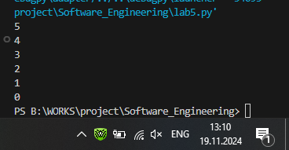

# Тема 10. Декораторы и исключения
Отчет по Теме #10 выполнил(а):
- Бойков Егор Сергеевич
- ИВТ-22-1

| Задание | Лаб_раб | Сам_раб |
| ------ | ------ | ------ |
| Задание 1 | + | + |
| Задание 2 | + | + |
| Задание 3 | + | + |
| Задание 4 | + | + |
| Задание 5 | + | + |

знак "+" - задание выполнено; знак "-" - задание не выполнено;

Работу проверили:
- к.э.н., доцент Панов М.А.

## Лабораторная работа №1
### Наверняка вы думаете, что декораторы – это какая-то бесполезная вещь, которая вам никогда не пригодится, но тут вдруг на паре по математике преподаватель просит всех посчитать число Фибоначчи для 100. Кто-то будет считать вручную (так точно не нужно), кто-то посчитает на калькуляторе, а кто-то подумает, что он самый крутой и напишет рекурсивную программу на Python и немного огорчится, потому что данная программа будет достаточно долго считаться, если ее просто так запускать. Но именно тут к вам на помощь приходят декораторы, например @lru_cache (он предназначен для решения задач динамическим программированием, если простыми словами, то этот декоратор запоминает промежуточные результаты и при рекурсивном вызове функции программа не будет считать одни и те же значения, а просто “возьмёт их из этого декоратора”). Вам нужно написать программу, которая будет считать числа Фибоначчи для 100 и запустить ее без этого декоратора и с ним, посмотреть на разницу во времени решения поставленной задачи.
P.S. при запуске без декоратора можете долго не ждать, для наглядности хватит 10 секунд ожидания.

```python
from functools import lru_cache

@lru_cache(None)
def fibonacci(n):
    if n == 0:
        return 0
    elif n == 1:
        return 1
    return fibonacci(n - 1) + fibonacci(n - 2)

if __name__ == '__main__':
    print(fibonacci(100))
```
### Результат.

## Выводы

## Лабораторная работа №2
### Илья пишет свой сайт и ему необходимо сделать минимальную проверку ввода данных пользователя при регистрации. Для этого он реализовал функцию, которая выводит данные пользователя на экран и решил, что будет проверять правильность введённых данных при помощи декоратора, но в этом ему потребовалась ваша помощь. Напишите декоратор для функции, который будет принимать все параметры вызываемой функции (имя, возраст) и проверять чтобы возраст был больше 0 и меньше 130. Причем заметьте, что неважно сколько пользователь введет данных на сайт к Илье, будут обрабатываться только первые 2 аргумента.


```python
def check(input_func):
    def output_func(*args):
        name, age = args[0], args[1]

        if age <= 0 or age >= 130:
            age = 'Недопустимый возраст'
        input_func(name, age)

    return output_func

@check
def personal_info(name, age):
    print(f"Name: {name} Age: {age}")

if __name__ == '__main__':
    personal_info('Саша', 20)
    personal_info('Петя', -9)
    personal_info('Ваня', 2,75,2)
```
### Результат.

## Выводы

## Лабораторная работа №3
### Вам понравилась идея Ильи с сайтом, и вы решили дальше работать вместе с ним. Но вот в вашем проекте появилась проблема, кто-то пытается сломать вашу функцию с получением данных для сайта. Эта функция работает только с данными integer, а какой-то недохакер пытается все сломать и вместо нужного типа данных отправляет string. Воспользуйтесь исключениями, чтобы неподходящий тип данных не ломал ваш сайт. Также дополнительно можете обернуть весь код функции в try/except/finally для того, чтобы программа вас оповестила о том, что выявлена какая-то ошибка или программа успешно выполнена.

```python


```
### Результат.

## Выводы

## Лабораторная работа №4
### Вам прекрасно известно, что кошки и собаки являются млекопитающими, но компьютер этого не понимает, поэтому вам нужно написать три класса: Кошки, Собаки, Млекопитающие. И при помощи “наследования” объяснить компьютеру что кошки и собаки – это млекопитающие. Также добавьте какой-нибудь свой атрибут для кошек и собак, чтобы показать, что они чем-то отличаются друг от друга.


```python
class Mammal:
    className = 'Mammal'

class Dog(Mammal):
    species = 'canine'
    sounds = 'wow'

class Cat(Mammal):
    species = 'feline'
    sounds = 'meow'

dog = Dog()
cat = Cat()
print(f"Dog is {dog.className}, but they say {dog.sounds}")
print(f"Cat is {cat.className}, but they say {cat.sounds}")
```
### Результат.


## Выводы
В данной работе были созданы классы для животных, используя наследование, чтобы показать, что кошки и собаки являются млекопитающими. Пример успешно демонстрирует механизм наследования и показывает, что каждый подкласс может иметь свои уникальные свойства.


## Лабораторная работа №5
### На разных языках здороваются по-разному, но суть остается одинаковой, люди друг с другом здороваются. Давайте вместе с вами реализуем программу с полиморфизмом, которая будет описывать всю суть первого предложения задачи. Для этого мы можем выбрать два языка, например, русский и английский и написать для них отдельные классы, в которых будет в виде атрибута слово, которым здороваются на этих языках. А также напишем функцию, которая будет выводить информацию о том, как на этих языках здороваются. Заметьте, что для решения поставленной задачи мы использовали декоратор @staticmethod, поскольку нам не нужны обязательные параметры-ссылки вроде self.


```python
class Russian:
    @staticmethod
    def greeting():
        print("Привет")

class English:
    @staticmethod
    def greeting():
        print("Hello")

def greet(language):
    language.greeting()

Ivan = Russian()
John = English()
greet(Ivan)
greet(John)
```
### Результат.


## Выводы
В этой лабораторной работе был показан пример полиморфизма, реализованный через статические методы в двух классах и функцию greet(), принимающую объект класса. Таким образом, разные классы могут использовать один и тот же метод для выполнения задачи.


## Самостоятельная работа №1
### Задание Садовник и помидоры.

Классовая структура:

Есть Помидор со следующими характеристиками:

•	Индекс

•	Стадия созревания (стадии: отсутствует, цветение, зеленый, красный)

Помидор может:

•	Расти (переходить на следующую стадию созревания)

•	Предоставлять информацию о своей зрелости

Есть Куст с помидорами, который:

•	Содержит список томатов, которые на нем растут

А также может:

•	Расти вместе с томатами

•	Предоставлять информацию о зрелости всех томатов

•	Предоставлять урожай

И также есть Садовник, который имеет:

•	Имя

•	Растение, за которым он ухаживает

Он может:

•	Ухаживать за растением

•	Собирать с него урожай

Задание:

Класс Tomato:
1)	Создайте класс Tomato
2)	Создайте статическое свойство states, которое будет содержать все стадии созревания помидора
3)	Создайте метод	init	(), внутри которого будут определены два динамических свойства: _index (передается параметром) и _state (принимает первое значение из словаря states). После написания этого блока кода в комментарии к нему укажите какими являются эти два свойства
4)	Создайте метод grow(), который будет переводить томат на следующую стадию созревания
5)	Создайте метод is_ripe(), который будет проверять, что томат созрел

Класс TomatoBush:
1)	Создайте класс TomatoBush
2)	Определите метод	init	(), который будет принимать в качестве параметра количество томатов и на его основе будет создавать список объектов класса Tomato. Данный список будет храниться внутри динамического свойства tomatoes
3)	Создайте метод grow_all(), который будет переводить все объекты из списка томатов на следующий этап созревания
4)	Создайте метод all_are_ripe(), который будет возвращать True, если все томаты из списка стали спелыми.
5)	Создайте метод give_away_all(), который будет чистить список томатов после сбора урожая

Класс Gardener:
1)	Создайте класс Gardener
2)	Создайте метод	init	(), внутри которого будут определены два динамических свойства: name (передается параметром, является публичным) и _plant (принимает объект класса TomatoBush). После написания этого блока кода в комментарии к нему укажите какими являются эти два свойства
3)	Создайте метод work(), который заставляет садовника работать, что позволяет растению становиться более зрелым
4)	Создайте метод harvest(), который проверяет, все ли плоды созрели. Если все, то садовник собирает урожай. Если нет, то метод печатает предупреждение
5)	Создайте статический метод knowledge_base(), который выведет в консоль справку по садоводству

Тесты:
1)	Вызовите справку по садоводству
2)	Создайте объекты классов TomatoBush и Gardener
3)	Используя объект класса Gardener, поухаживайте за кустом с помидорами
4)	Попробуйте собрать урожай, когда томаты еще не дозрели. Продолжайте ухаживать за ними 
5)	Соберите урожай

Результатом работы вашей программы будет листинг кода с подробными комментариями и скриншоты выполенния всех тестов.

```python
class Tomato:
    # Статическое свойство, содержащее стадии созревания помидора
    states = {0: 'Отсутствие завязи', 1: 'Цветение', 2: 'Зеленый', 3: 'Спелый'}

    def __init__(self, index):
        # _index - уникальный индекс томата
        # _state - текущая стадия созревания, изначально первая стадия из states
        self._index = index
        self._state = 0  # Начальное состояние: 0 (Отсутствие завязи)

    def grow(self):
        # Переводит томат на следующую стадию созревания, если она не максимальная
        if self._state < max(self.states):
            self._state += 1

    def is_ripe(self):
        # Проверяет, достиг ли томат последней стадии созревания (3 - Спелый)
        return self._state == max(self.states)


class TomatoBush:
    def __init__(self, count):
        # tomatoes - список объектов Tomato, количество задается параметром count
        self.tomatoes = [Tomato(index) for index in range(count)]

    def grow_all(self):
        # Переводит все томаты в кусте на следующую стадию созревания
        for tomato in self.tomatoes:
            tomato.grow()

    def all_are_ripe(self):
        # Проверяет, все ли томаты в кусте достигли стадии "Спелый"
        return all(tomato.is_ripe() for tomato in self.tomatoes)

    def give_away_all(self):
        # Очищает куст, убирая все томаты (сбор урожая)
        self.tomatoes = []


class Gardener:
    def __init__(self, name, plant):
        # name - имя садовника (публичное свойство)
        # _plant - растение, за которым ухаживает садовник (объект TomatoBush)
        self.name = name
        self._plant = plant

    def work(self):
        # Ухаживает за растением, переводя все его томаты на следующую стадию созревания
        print(f"{self.name} ухаживает за растением...")
        self._plant.grow_all()

    def harvest(self):
        # Если все томаты созрели, собирает урожай; если нет, предупреждает об этом
        if self._plant.all_are_ripe():
            print("Все томаты созрели. Собираем урожай!")
            self._plant.give_away_all()
        else:
            print("Томаты еще не созрели. Необходимо больше ухода.")

    @staticmethod
    def knowledge_base():
        # Выводит справку по садоводству
        print("Справка по садоводству:\n"
              "1. Ухаживайте за растением, чтобы томаты созревали.\n"
              "2. Сбор урожая возможен только после полного созревания томатов.\n"
              "3. Следите за стадиями созревания томатов и ухаживайте за ними регулярно.")

# Тесты

# Вызов справки по садоводству
Gardener.knowledge_base()

# Создание объекта TomatoBush с 3 томатами
bush = TomatoBush(3)

# Создание садовника для ухода за кустом
gardener = Gardener("Анна", bush)

# Уход за кустом с помидорами
gardener.work()  # Первая стадия ухода
gardener.harvest()  # Попытка собрать урожай (еще не созрел)

# Повторный уход
gardener.work()  # Вторая стадия ухода
gardener.harvest()  # Попытка собрать урожай (еще не созрел)

# Третий этап ухода, после которого томаты должны созреть
gardener.work()
gardener.harvest()  # Теперь томаты должны быть собраны, так как они созрели

```
### Результат.


## Выводы
В работе был создан класс для моделирования процесса выращивания помидоров, кустов и действий садовника. Разработаны функции для контроля стадии созревания, ухода и сбора урожая. Пример иллюстрирует взаимодействие объектов и применение полиморфизма в реальной задаче.


## Общие выводы по теме

Задания продемонстрировали основные принципы ООП в Python: инкапсуляцию, наследование и полиморфизм. Через различные примеры удалось увидеть, как классы, методы и свойства используются для моделирования объектов и их поведения.


