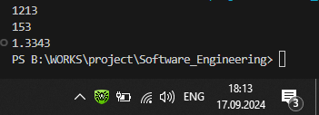
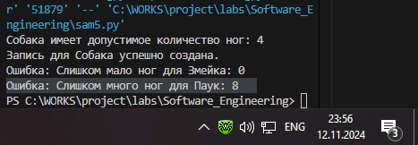

# Тема 2. Базовые операции языка Python
Отчет по Теме #2 выполнил(а):
- Бойков Егор Сергеевич
- ИВТ-22-1

| Задание | Лаб_раб | Сам_раб |
| ------ | ------ | ------ |
| Задание 1 | + | + |
| Задание 2 | + | + |
| Задание 3 | + | + |
| Задание 4 | + | + |
| Задание 5 | + | + |
| Задание 6 | + | + |
| Задание 7 | + | + |
| Задание 8 | + | + |
| Задание 9 | + | + |
| Задание 10 | + | + |

знак "+" - задание выполнено; знак "-" - задание не выполнено;

Работу проверили:
- к.э.н., доцент Панов М.А.
## Лабораторная работа №1
### Выведите в консоль три строки. Первая – любое число. Вторая – любое число в виде строки. Третья – любое число с плавающей точкой.

''' python 
print(1213)
print("153")
print(1.3343)
'''
### Результаты 

## Выводы
В данном примере в консоль выводятся три значения: целое число, строка и число с плавающей точкой. Это демонстрирует базовые возможности функции print() по выводу различных типов данных.

## Лабораторная работа №2
### Выведите в консоль три строки. Первая – результат сложения или вычитания минимум двух переменных типа int. Вторая – результат сложения или вычитания минимум двух переменных типа float. Третья – результат сложения или вычитания минимум двух переменных типа int и float.

''' python
print(13242+12)
print(23.12+2332.1)
print(1212+7.21-111)
'''
### Результаты

## Выводы
Этот код показывает, как выполняются базовые арифметические операции над целыми и вещественными числами, а также их комбинациями. Это иллюстрирует работу с числовыми типами данных в Python.

## Лабораторная работа №3
### Выведите в консоль три строки. Первая – обычная строка. Вторая – F строка с использованием заранее объявленной переменной. Третья – сложите две или более строк в одну.

''' python
print('sdsd')
x = 10
print(f"dwdwdw {x}")
print("hello" +"Sea")
'''
### Результаты

## Выводы
Пример демонстрирует работу с текстовыми строками в Python, включая использование обычных строк, f-строк для динамического формирования текста, а также конкатенацию строк.

## Лабораторная работа №4
### Выведите в консоль три строки. Первая – трансформация любого типа переменной в bool. Вторая – трансформация любого типа переменной в float или int. Третья – трансформация любого типа переменной в str.

''' python
x = 10
print(bool(x))
y = 12
print(float(y))
z = True
print(str(z))
'''
### Результаты

## Выводы
В этой задаче показано преобразование различных типов данных: в булевый тип, в вещественный и в строковый тип, что важно для понимания типов данных и их трансформации.

## Лабораторная работа №5
### Присвойте трем переменным различные значения, воспользовавшись функцией input().

''' python 
x = input()
y = input()
z = input()
print(x, y, z)
'''
### Результаты

## Выводы
Программа демонстрирует использование функции input() для получения данных от пользователя и их вывода в консоль. Это ключевой элемент взаимодействия программы с пользователем.

## Лабораторная работа №6
### Создайте две любые числовые переменные и выполните над ними несколько математических операций: возведение в степень, обычное деление, целочисленное деление, нахождение остатка от деления. При желании вы можете проверить как работают эти вычисления с разными типами данных, например, сначала создать две переменные int, затем создать две переменные float и наконец создать переменные типа int и float и провести над ними операции, прописанные выше.

''' python 
a = 23
b = 2
print(a**b, a/b, a//b, a%2 )
'''
### Результаты

## Выводы
Выполняются различные математические операции, такие как возведение в степень, деление и нахождение остатка от деления. Пример демонстрирует работу с числами в Python.

## Лабораторная работа №7
### Создайте любую строковую переменную и произведите над ней математическое действие умножение на любое число.

''' python 
x = "s"
print(x*20)
'''
### Результаты

## Выводы
Этот пример показывает, как можно умножать строки на число для их многократного повторения, что может быть полезно при работе с текстовыми данными.

## Лабораторная работа №8
### Посчитайте сколько раз символ ‘o’ встречается в строке ‘Hello World’.

''' python 
x = "Hello World"
print(x.count("o"))
'''
### Результаты

## Выводы 
В этой задаче выполнен подсчет символов в строке. Это демонстрирует основы работы со строками и использования методов для их обработки.

## Лабораторная работа №9
### Напишите предложение ‘Hello World’ в две строки. Написанная программа должна занимать одну строку в редакторе кода.

''' python 
print("Hello\nWorld")
'''
### Результаты

## Выводы 
Пример иллюстрирует использование символа переноса строки \n для вывода текста в несколько строк, что может быть полезно при форматировании вывода.

## Лабораторная работа №10
### Из предложения ‘Hello World’ выведите в консоль только 2 символ, а затем выведите слово ‘Hello’

''' python 
x = "Hello World"
print(x[1], x[:5])
'''
### Результаты

## Выводы 
Код показывает, как работать с индексами строк для извлечения отдельных символов и частей строк, что является важной частью работы с текстом.

## Самостоятельная работа №1
### Выведите в консоль булевую переменную False, не используя слово False в строке или изначально присвоенную булевую переменную. Программа должна занимать не более двух строк редактора кода.

''' python 
print(bool(0))
'''
### Результаты

## Выводы 
Булевое значение False было получено через приведение нулевого значения к булевому типу, что иллюстрирует логику работы с булевыми переменными в Python.

## Самостоятельная работа №2
### Присвоить значения трем переменным и вывести их в консоль, используя только две строки редактора кода

''' python 
a, b, z = 12 , 23, 54
print(a, b, z)
'''
### Результаты

## Выводы 
Задача демонстрирует возможность присваивания значений нескольким переменным одновременно и их вывода в консоль, что сокращает код и повышает его читаемость.

## Самостоятельная работа №3
### Реализуйте ввод данных в программу, через консоль, в виде только целых чисел (тип данных int). То есть при вводе буквенных символов в консоль, программа не должна работать. Программа должна занимать не более двух строк редактора кода. 

''' python 
print(int(input()))
'''
### Результаты

## Выводы 
Код показывает, как ограничить ввод только целыми числами с использованием функции int(), что помогает предотвратить ошибки при работе с данными от пользователя.

## Самостоятельная работа №4
### Создайте только одну строковую переменную. Длина строки должна не превышать 5 символов. На выходе мы должны получить строку длиной не менее 16 символов. Программа должна занимать не более двух строк редактора кода.

''' python 
x = "s"
print(x*17)
'''
### Результаты

## Выводы 
Пример демонстрирует создание строки путем умножения короткой строки на число, что позволяет быстро создавать длинные строки.

## Самостоятельная работа №5
### Создайте три переменные: день (тип данных - числовой), месяц (тип данных - строка), год (тип данных - числовой) и выведите в консоль текущую дату в формате: “Сегодня день месяц год. Всего хорошего!” используя F строку и оператор end внутри print(), в котором вы должны написать фразу “Всего хорошего!”. Программа должна занимать не более двух строк редактора кода.

''' python 
day, month, year = 20, 'января', 2024
print(f"Сегодня {day} {month} {year}. ", end = 'Всего хорошего!')
'''
### Результаты

## Выводы 
Задача демонстрирует использование f-строк для динамического вывода текста и использования оператора end для изменения поведения функции print().

## Самостоятельная работа №6
### В предложении ‘Hello World’ вставьте ‘my’ между двумя словами. Выведите полученное предложение в консоль в одну строку. Программа должна занимать не более двух строк редактора кода. 

''' python 
x = 'Hello World'
print(x[:5], "my", x[6:])
'''
### Результаты

## Выводы 
Задача показывает, как можно легко изменять строки с помощью индексов и конкатенации для вставки новых элементов в текст.

## Самостоятельная работа №7
### Узнайте длину предложения ‘Hello World’, результат выведите в консоль. Программа должна занимать не более двух строк редактора кода.

''' python 
print(len("Hello World"))
'''
### Результаты

## Выводы 
Этот код выводит длину строки, показывая, как можно измерить количество символов в строке с помощью функции len().

## Самостоятельная работа №8
### Переведите предложение ‘HELLO WORLD’ в нижний регистр. Программа должна занимать не более двух строк редактора кода.

''' python 
print("HELLO WORLD".lower())
'''
### Результаты

## Выводы 
Пример демонстрирует работу со строковыми методами, такими как перевод текста в нижний регистр, что важно при форматировании текста.

## Самостоятельная работа №9
### Самостоятельно придумайте задачу по проходимой теме и решите ее. Задача должна быть связанна со взаимодействием с числовыми значениями. Задача: Вывести последние число любого числа.

''' python 
x =132324
print(x % 10)
'''
### Результаты

## Выводы 
Задача показывает использование арифметических операций для получения последней цифры числа через остаток от деления, что полезно для работы с числами.

## Самостоятельная работа №10
### Самостоятельно придумайте задачу по проходимой теме и решите ее. Задача должна быть связанна со взаимодействием со строковыми значениями. Задача - Пусть при выводе строк из print  каждая  будет с новой строки

''' python 
print(1,2,3,4,5,6,7, sep="\n")
'''
### Результаты

## Выводы 
Пример демонстрирует вывод нескольких значений с новой строки, используя параметр sep, что облегчает форматирование вывода.

## Общие выводы по теме
-  Изучение базовых операций языка Python помогает лучше понять, как работать с различными типами данных, выполнять простые математические и строковые операции, а также взаимодействовать с консолью. На практике это важно для создания простых программ, обработки вводимых данных и их корректного вывода
