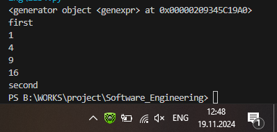

# Тема 4. Функции и стандартные модули/библиотеки
Отчет по Теме #4 выполнил(а):
- Бойков Егор Сергеевич
- ИВТ-22-1

| Задание | Лаб_раб | Сам_раб |
| ------ | ------ | ------ |
| Задание 1 | + | + |
| Задание 2 | + | + |
| Задание 3 | + | + |
| Задание 4 | + | + |
| Задание 5 | + | + |
| Задание 6 | + |  |
| Задание 7 | + |  |
| Задание 8 | + |  |
| Задание 9 | + |  |
| Задание 10 | + |  |

знак "+" - задание выполнено; знак "-" - задание не выполнено;

Работу проверили:
- к.э.н., доцент Панов М.А.

## Лабораторная работа №1
### Напишите функцию, которая выполняет любые арифметические действия и выводит результат в консоль. Вызовите функцию используя “точку входа”.

```python
def main():
    print(7*7)
if __name__ == "__main__":
    main()
```
### Результат.

## Выводы


## Лабораторная работа №2
### Напишите функцию, которая выполняет любые арифметические действия, возвращает при помощи return значение в место, откуда вызывали функцию. Выведите результат в консоль. Вызовите функцию используя “точку входа”.


```python
def main():
    return(7*7)
if __name__ == "__main__":
    print(main())
```
### Результат.

## Выводы


## Лабораторная работа №3
### Напишите функцию, в которую передаются два аргумента, над ними производится арифметическое действие, результат возвращается туда, откуда эту функцию вызывали. Выведите результат в консоль. Вызовите функцию в любом небольшом цикле.


```python
def main(a ,b):
    return a * b

for i in range(10):
    a = 2 * i
    b = 3 * i
    print(main(a , b))
```
### Результат.

## Выводы


## Лабораторная работа №4
### Напишите функцию, на вход которой подается какое-то изначальное неизвестное количество аргументов, над которыми будет производится арифметические действия. Для выполнения задания необходимо использовать кортеж “*args”. 


```python
def main (*args):
    x = max(args)
    y = sum(args)
    return y / x + 1
if __name__ == "__main__":
    print(main(12,-43,12,56,888,13))
```
### Результат.


## Выводы

## Лабораторная работа №5
### Напишите функцию, которая на вход получает кортеж “**kwargs” и при помощи цикла выводит значения, поступившие в функцию. На скриншоте ниже указаны два варианта вызова функции с “**kwargs” и два варианта работы с данными, поступившими в эту функцию. Комментарии в коде и теоретическая часть помогут вам разобраться в этом нелегком аспекте. Вызовите функцию используя “точку входа”.

```python
def main(**kwargs):
    for  i in kwargs.items():
        print(i[0], i[1])

if __name__ == "__main__":
    main(a=[1,2,3],y=[45,-2,0])
```
### Результат.


## Выводы

## Лабораторная работа №6
### Напишите две функции. Первая – получает в виде параметра “**kwargs”. Вторая считает среднее арифметическое из значений первой функции. Вызовите первую функцию используя “точку входа” и минимум 4 аргумента.


```python
def main(**kwargs):
    for i, j in kwargs.items():
        print(i, mean(j))
def mean(d):
    return sum(d) / float(len(d))

if __name__ == "__main__":
    main(a=[1,2,3],y=[45,-2,0])
```
### Результат.


## Выводы

## Лабораторная работа №7
### Создайте дополнительный файл .py. Напишите в нем любую функцию, которая будет что угодно выводить в консоль, но не вызывайте ее в нем. Откройте файл main.py, импортируйте в него функцию из нового файла и при помощи “точки входа” вызовите эту функцию.

```python
def arf():
    print(10*-23)

import import_mod
import_mod.arf()
```
### Результат.


## Выводы


## Лабораторная работа №8
### Напишите программу используя цикл while, внутри которого есть какие-либо проверки, но быть осторожным, поскольку циклы while при неправильно написанных условиях могут становится бесконечными, как указано в примере далее.

```python
x= 4
while(-12 < x <=256):
    if (x % 2 == 0 ):
        x*=2
    elif(x > 30):
        x//=2
        x+=2
    else: x+=13
    print(x)
```
### Результат.


## Выводы
Программа использует цикл while для выполнения различных операций с переменной. Особое внимание уделено предотвращению бесконечных циклов. Это задание помогает понять, как работает цикл while и какие меры следует принимать для предотвращения бесконечного выполнения.

## Лабораторная работа №9
### Напишите программу с использованием вложенных циклов и одной проверкой внутри них. Самое главное, не забудьте, что нельзя использовать одинаковые имена итерируемых переменных, когда вы используете вложенные циклы.

```python
for i in range(10):
    for y in range(10):
        if(i%2==0):
            i+=1
        print(i, y)
```
### Результат.


## Выводы
Программа демонстрирует использование вложенных циклов с проверкой условий внутри них. Задание помогает закрепить навыки работы с циклическими структурами и учит избегать конфликтов при использовании одинаковых имён переменных.

## Лабораторная работа №10
### Напишите программу с использованием flag, которое будет определять есть ли нечетное число в массиве. В данной задаче flag выступает в роли индикатора встречи нечетного числа в исходном массиве, четных чисел.

```python
array = [1,2,3,4,5,6,7,8]
flag =False
for i in array:
    if (i % 2 == 0):
        flag = True
if(flag == True):
    print("Есть чётные")
else: print("Нету")
```
### Результат.


## Выводы
Программа использует флаг для проверки наличия нечётных чисел в массиве. Это задание показывает, как можно использовать булевы переменные для контроля процесса работы программы.

## Самостоятельная работа №1
### Напишите программу, которая преобразует 1 в 31.
Для выполнения поставленной задачи необходимо обязательно и только один раз использовать:

•	Цикл for

•	*= 5

•	+= 1

Никаких других действий или циклов использовать нельзя.

```python
x = 1
for i in range(7):()
i*=5
i+=1
print(i)
```
### Результат.


## Выводы
Программа преобразует 1 в 31 с использованием цикла for, операций умножения и сложения. Это задание демонстрирует ограниченное использование циклов для выполнения определённых задач.

## Самостоятельная работа №2
### Напишите программу, которая фразу «Hello World» выводит в обратном порядке, и каждая буква находится в одной строке консоли. При этом необходимо обязательно использовать любой цикл, а также программа должна занимать не более 3 строк в редакторе кода.

```python
line = 'Hello World'
for i in range(len(line)-1, -1, -1):
    print(line[i])
```
### Результат.


## Выводы
Программа выводит фразу "Hello World" в обратном порядке, используя цикл. Каждая буква выводится в новой строке, что помогает понять основы работы с индексами и циклами для строк.

## Самостоятельная работа №3
### Напишите программу, на вход которой поступает значение из консоли, оно должно быть числовым и в диапазоне от 0 до 10 включительно (это необходимо учесть в программе). Если вводимое число не подходит по требованиям, то необходимо вывести оповещение об этом в консоль и остановить программу. Код должен вычислять в каком диапазоне находится полученное число. Нужно учитывать три диапазона:

•	от 0 до 3 включительно

•	от 3 до 6

•	от 6 до 10 включительно

Результатом работы программы будет выведенный в консоль диапазон. Программа должна занимать не более 10 строчек в редакторе кода.

```python
x = int(input())
if 0 <= x <= 10:
    if 0 <= x <= 3:
        print("от 0 до 3 включительно")
    elif 3 < x < 6:
        print("от 3 до 6")
    elif 6 <= x <= 10:
        print("от 6 до 10 включительно")
else:
    print('стоп')
```
### Результат.


## Выводы
Программа проверяет введённое число на соответствие диапазонам и выводит соответствующее сообщение. Если число не попадает в диапазон от 0 до 10, программа останавливается. Задание демонстрирует работу с вложенными условиями.

## Самостоятельная работа №4
### Манипулирование строками. Напишите программу на Python, которая принимает предложение (на английском) в качестве входных данных от пользователя. Выполните следующие операции и отобразите результаты:

•	Выведите длину предложения.

•	Переведите предложение в нижний регистр.

•	Подсчитайте количество гласных (a, e, i, o, u) в предложении.

•	Замените все слова "ugly" на "beauty".

•	Проверьте, начинается ли предложение с "The" и заканчивается ли на "end".

Проверьте работу программы минимум на 3 предложениях, чтобы охватить проверку всех поставленных условий.

```python
s = input()
g = ["а", "е", "і", "о", "u"]
if (s.startswith('The') and s.endswith('end')):
    print("начинается  предложение с The и заканчивается  на end")
s = s.lower()
c = 0
for i in s:
    if(i in g):
        c+=1
s = s.replace('ugly', 'beauty')
print(len(s))
print(s)
```
### Результат.


## Выводы
Программа выполняет различные операции со строкой, такие как перевод в нижний регистр, подсчёт гласных и замена слов. Также она проверяет, начинается ли строка с "The" и заканчивается ли на "end". Задание помогает разобраться с манипуляциями со строками.


## Самостоятельная работа №5
### Составьте программу, результатом которой будет данный вывод в консоль:


```python
string = 'hello'
values = [0, 2, 4, 6, 8, 10]
counter = 0
while ' world' not in string:
    memory = string
    if counter in values:
        string = string + ' world'
    print(string)
    if counter < 10:
        string = memory
    counter += 1
```
### Результат.


## Выводы
Программа использует цикл while для вывода строки "hello world" в зависимости от значения счётчика. Это задание демонстрирует работу с циклами и проверку условий внутри циклов.

## Общие выводы по теме
В данной теме были рассмотрены основные принципы работы с операторами условий, циклами и различными операциями в Python. Каждое задание способствовало закреплению навыков работы с конструкциями if, else, for, while и логическими операторами.