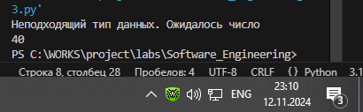

# Тема 4. Функции и стандартные модули/библиотеки
Отчет по Теме #4 выполнил(а):
- Бойков Егор Сергеевич
- ИВТ-22-1

| Задание | Лаб_раб | Сам_раб |
| ------ | ------ | ------ |
| Задание 1 | + | + |
| Задание 2 | + | + |
| Задание 3 | + | + |
| Задание 4 | + | + |
| Задание 5 | + | + |
| Задание 6 | + |  |
| Задание 7 | + |  |
| Задание 8 | + |  |
| Задание 9 | + |  |
| Задание 10 | + |  |

знак "+" - задание выполнено; знак "-" - задание не выполнено;

Работу проверили:
- к.э.н., доцент Панов М.А.

## Лабораторная работа №1
### Напишите функцию, которая выполняет любые арифметические действия и выводит результат в консоль. Вызовите функцию используя “точку входа”.

```python
def main():
    print(7*7)
if __name__ == "__main__":
    main()
```
### Результат.

## Выводы
В этой работе была написана простая функция, которая выполняет арифметическое действие — умножение 7 на 7. Функция вызывается с помощью "точки входа" __main__, и результат выводится в консоль.

## Лабораторная работа №2
### Напишите функцию, которая выполняет любые арифметические действия, возвращает при помощи return значение в место, откуда вызывали функцию. Выведите результат в консоль. Вызовите функцию используя “точку входа”.


```python
def main():
    return(7*7)
if __name__ == "__main__":
    print(main())
```
### Результат.

## Выводы
Функция возвращает результат операции умножения 7 на 7 с использованием return. Результат возвращается в точку, откуда функция была вызвана, и выводится в консоль.

## Лабораторная работа №3
### Напишите функцию, в которую передаются два аргумента, над ними производится арифметическое действие, результат возвращается туда, откуда эту функцию вызывали. Выведите результат в консоль. Вызовите функцию в любом небольшом цикле.


```python
def main(a ,b):
    return a * b

for i in range(10):
    a = 2 * i
    b = 3 * i
    print(main(a , b))
```
### Результат.

## Выводы
Функция принимает два аргумента, выполняет с ними умножение и возвращает результат. Вызов функции организован внутри цикла, где аргументы динамически изменяются.

## Лабораторная работа №4
### Напишите функцию, на вход которой подается какое-то изначальное неизвестное количество аргументов, над которыми будет производится арифметические действия. Для выполнения задания необходимо использовать кортеж “*args”. 


```python
def main (*args):
    x = max(args)
    y = sum(args)
    return y / x + 1
if __name__ == "__main__":
    print(main(12,-43,12,56,888,13))
```
### Результат.


## Выводы
Функция принимает неопределенное количество аргументов через *args, выполняет математические действия — деление суммы аргументов на максимальный элемент с добавлением единицы.

## Лабораторная работа №5
### Напишите функцию, которая на вход получает кортеж “**kwargs” и при помощи цикла выводит значения, поступившие в функцию. На скриншоте ниже указаны два варианта вызова функции с “**kwargs” и два варианта работы с данными, поступившими в эту функцию. Комментарии в коде и теоретическая часть помогут вам разобраться в этом нелегком аспекте. Вызовите функцию используя “точку входа”.

```python
def main(**kwargs):
    for  i in kwargs.items():
        print(i[0], i[1])

if __name__ == "__main__":
    main(a=[1,2,3],y=[45,-2,0])
```
### Результат.


## Выводы
Используя **kwargs, функция выводит пары ключ-значение, поступившие в качестве аргументов. Реализован вывод словаря через цикл.

## Лабораторная работа №6
### Напишите две функции. Первая – получает в виде параметра “**kwargs”. Вторая считает среднее арифметическое из значений первой функции. Вызовите первую функцию используя “точку входа” и минимум 4 аргумента.


```python
def main(**kwargs):
    for i, j in kwargs.items():
        print(i, mean(j))
def mean(d):
    return sum(d) / float(len(d))

if __name__ == "__main__":
    main(a=[1,2,3],y=[45,-2,0])
```
### Результат.


## Выводы
Написаны две функции: первая принимает **kwargs, вторая считает среднее арифметическое значений, переданных первой функции.

## Лабораторная работа №7
### Создайте дополнительный файл .py. Напишите в нем любую функцию, которая будет что угодно выводить в консоль, но не вызывайте ее в нем. Откройте файл main.py, импортируйте в него функцию из нового файла и при помощи “точки входа” вызовите эту функцию.

```python
def arf():
    print(10*-23)

import import_mod
import_mod.arf()
```
### Результат.


## Выводы
Создана дополнительная функция в отдельном модуле, импортирована и вызвана через "точку входа". Она выводит результат математического действия.

## Лабораторная работа №8
### Напишите программу, которая будет выводить корень, синус, косинус полученного от пользователя числа.

```python
import math

def main():
    x = int(input())
    print(math.sqrt(x))
    print(math.sin(x))
    print(math.cos(x))

if __name__ == "__main__":
    main()
```
### Результат.


## Выводы
Программа вычисляет математические функции (корень, синус, косинус) для числа, введенного пользователем.

## Лабораторная работа №9
### Напишите программу, которая будет рассчитывать какой день недели будет через n-нное количество дней, которые укажет пользователь.


```python
from datetime import datetime as dt, timedelta as td
def main():
    n = int(input())
    t = dt.today()
    r = t + td(days=n)
    print(f"Через {n} дней будет {r.date()}." 
            f"день недели {r.isoweekday()}")
if __name__ == "__main__":
    main()
```
### Результат.


## Выводы
Программа рассчитывает, какой день недели будет через указанное количество дней, используя модуль datetime.

## Лабораторная работа №10
### Напишите программу с использованием глобальных переменных, которая будет считать площадь треугольника или прямоугольника в зависимости от того, что выберет пользователь. Получение всей необходимой информации реализовать через input(), а подсчет площадей выполнить при помощи функций. Результатом программы будет число, равное площади, необходимой фигуры.


```python
global result

def tr():
    a = float(input())
    b = float(input())
    global result
    result = 0.5 * a * b
def per():
    a = float(input())
    b = float(input())
    global result
    result =  a * b

x = input()
if x == "1":
    per()
elif x =="2":
    tr()
print(result)
```
### Результат.


## Выводы
Программа считает площадь прямоугольника или треугольника в зависимости от выбора пользователя с использованием глобальных переменных.

## Самостоятельная работа №1
### Дайте подробный комментарий для кода, написанного ниже. Комментарий нужен для каждой строчки кода, нужно описать что она делает. Не забудьте, что функции комментируются по-особенному.

```python
#Импорт класса datetime из библиотеки datetime
from datetime import datetime
#Импорт функции sqrt из библиотеки math
from math import sqrt

#Функция, принимающая любое количество аргументов в виде словаря
def main(**kwargs):
    """
    Вычисляет длину вектора по теореме Пифагора
    Параметры:
        **kwargs (словарь) - элементы со значениями начала и конца вектора
    Возвращает:
        float: длина вектора
    """
    #Проходимся по элементам kwargs с ключом key
    for key in kwargs.items():
        #Вычисление длины вектора по теореме Пифагора 
        result = sqrt(key[1][0] ** 2 + key[1][1] ** 2)
        #Вывод посчитанного результата
        print(result)
        
#Проверка "точки входа"
if __name__ == '__main__':
    #Запоминается начальное время перед началом вызова функции main
    start_time = datetime.now()
    #Вызов функции main, куда передаются наборы из 2 значений - списки
    main(
        one = [10, 3],
        two = [5, 4],
        three = [15, 13],
        four = [93, 53],
        five = [133, 15]
    )
    #Вычисляется время выполнения программы, т.е. из текущего вычитается зафиксированное
    time_costs = datetime.now() - start_time
    #Выводится время выполнения программы - значение time_costs
    print(f"Время выполнения программы - {time_costs}")
```
### Результат.


## Выводы
Даны комментарии к коду, который рассчитывает длину вектора с использованием теоремы Пифагора и замеряет время выполнения программы.

## Самостоятельная работа №2
### Напишите программу, которая будет заменять игральную кость с 6 гранями. Если значение равно 5 или 6, то в консоль выводится «Вы победили», если значения 3 или 4, то вы рекурсивно должны вызвать эту же функцию, если значение 1 или 2, то в консоль выводится «Вы проиграли». При этом каждый вызов функции необходимо выводить в консоль значение “кубика”. Для выполнения задания необходимо использовать стандартную библиотеку random. Программу нужно написать, используя одну функцию и “точку входа”


```python
import random

def dice():
    a = random.randint(1,6)
    print(a)
    if 5 == a or a == 6:
        print("Вы победили")
    elif 3 == a or a == 4:
        print("Переброс")
        dice()
    else: print("Вы проиграли")

if __name__ == "__main__":
    dice()
```
### Результат.


## Выводы
Реализована игра с кубиком, где результат броска определяет победу, проигрыш или необходимость переброса. Использована библиотека random.

## Самостоятельная работа №3
### Напишите программу, которая будет выводить текущее время, с точностью до секунд на протяжении 5 секунд. Программу нужно написать с использованием цикла. Подсказка: необходимо использовать модуль datetime и time, а также вам необходимо как-то “усыплять” программу на 1 секунду.

```python
import datetime as dt, time
def main():
    for i in range(5):
        print(dt.datetime.now().strftime("%H:%M:%S"))
        time.sleep(1)
if __name__ == "__main__":
    main()
```
### Результат.


## Выводы
Программа выводит текущее время каждую секунду на протяжении 5 секунд, используя модули datetime и time.

## Самостоятельная работа №4
### Напишите программу, которая считает среднее арифметическое от аргументов вызываемое функции, с условием того, что изначальное количество этих аргументов неизвестно. Программу необходимо реализовать используя одну функцию и “точку входа”.

```python
import math
def main(*arg):
    print(sum(arg)/len(arg))
if __name__ == "__main__":
    main(1,23,4,4,4,7,9,12)
```
### Результат.


## Выводы
Функция считает среднее арифметическое неизвестного количества переданных аргументов.

## Самостоятельная работа №5
### Создайте два Python файла, в одном будет выполняться вычисление площади треугольника при помощи формулы Герона (необходимо реализовать через функцию), а во втором будет происходить взаимодействие с пользователем (получение всей необходимой информации и вывод результатов). Напишите эту программу и выведите в консоль полученную площадь.


```python
import math
def F(a, b, c):
    x = (a+b+c)/2
    result = math.sqrt(x*(x-a)*(x-b)*(x-c))
    return result

from sam5 import F
a = float(input())
b = float(input())
c = float(input())
result = F(a, b, c)
print(result)
```
### Результат.


## Выводы
Реализован расчет площади треугольника по формуле Герона, с раздельной обработкой данных в двух файлах.

## Общие выводы по теме
Работы продемонстрировали умение работать с аргументами функций, стандартными библиотеками, рекурсией и временем.