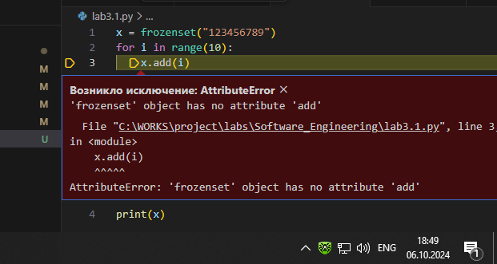

# Тема 5. Базовые коллекции: строки и списки
Отчет по Теме #5 выполнил(а):
- Бойков Егор Сергеевич
- ИВТ-22-1

| Задание | Лаб_раб | Сам_раб |
| ------ | ------ | ------ |
| Задание 1 | + | + |
| Задание 2 | + | + |
| Задание 3 | + | + |
| Задание 4 | + | + |
| Задание 5 | + | + |
| Задание 6 | + |  |
| Задание 7 | + |  |
| Задание 8 | + |  |
| Задание 9 | + |  |
| Задание 10 | + |  |

знак "+" - задание выполнено; знак "-" - задание не выполнено;

Работу проверили:
- к.э.н., доцент Панов М.А.

## Лабораторная работа №1
### Друзья предложили вам поиграть в игру “найди отличия и убери повторения (версия для программистов)”. Суть игры состоит в том, что на вход программы поступает два множества, а ваша задача вывести все элементы первого, которых нет во втором. А вы как раз недавно прошли множества и знаете их возможности, поэтому это не составит для вас труда.

```python
a = {1,2,3,4}
b ={1,2,5,6}
print(a - b)
```
### Результат.

## Выводы


## Лабораторная работа №2
### Напишите две одинаковые программы, только одна будет использовать set(), а вторая frozenset() и попробуйте к исходному множеству добавить несколько элементов, например, через цикл.

```python
x = set("123456789")
for i in range(10):
    x.add(i)
print(x)

x = frozenset("123456789")
for i in range(10):
    x.add(i)
print(x)
```
### Результат.


## Выводы


## Лабораторная работа №3
### На вход в программу поступает список (минимальной длиной 2 символа). Напишите программу, которая будет менять первый и последний элемент списка.

```python
x = [1,2,3,4,5,6]
x[0],x [-1]= x[-1],x[0]
print(x)
```
### Результат.

## Выводы


## Лабораторная работа №4
### На вход в программу поступает список (минимальной длиной 10 символов). Напишите программу, которая выводит элементы с индексами от 2 до 6. В программе необходимо использовать “срез”.


```python
x = [123,4546,6757,57,65487,58,75687,8,79,9,89,89,45,45]
print(x[2:6])
```
### Результат.


## Выводы


## Лабораторная работа №5
### Иван задумался о поиске «бесполезного» числа, полученного из списка. Суть поиска в следующем: он берет произвольный список чисел, находит самое большое из них, а затем делит его на длину списка. Студент пока не придумал, где может пригодиться подобное значение, но ищет у вас помощи в реализации такой функции useless().


```python
def use(a):
    return max(a) / len(a)

print(use([23,45,8,247,89,2,1,11,1,15656]))
```
### Результат.


## Выводы


## Лабораторная работа №6
### Ребята не могут определится каким супергероем они хотят стать. У них есть случайно составленный список супергероев, и вы должны определить кто из ребят будет каким супергероем. Необходимо использовать разделение списков.


```python
super = ["batman", "Ladybug", "spider-man"]
P, M, I =super
print("Петя ", P)
print("Маша", M)
print("Иван ", I) 
```
### Результат.


## Выводы


## Лабораторная работа №7
### Вовочка, насмотревшись передачи “Слабое звено” решил написать программу, которая также будет находить самое слабое звено (минимальный элемент) и удалять его, только делать он это хочет не с людьми, а со списком. Помогите Вовочке с реализацией программы. Подсказка: для этого вам необходимо отсортировать список и удалить значение при помощи pop().

```python
x =[1,2,0,-23,5678,212]
x.sort()
x.pop(0)
print(x)

```
### Результат.


## Выводы

## Лабораторная работа №8
### Михаил решил создать большой n-мерный список, для этого он случайным образом создал несколько списков, состоящих минимум из 3, а максимум из 10 элементов и поместил их в один большой список. Он также как и Иван не знает зачем ему это сейчас нужно, но надеется на то, что это пригодится ему в будущем.

```python
from random  import randint
def list_Rand():
    a = [randint(1,100)*randint(3,10)]
    return a
if __name__ == "__main__":
    result =[]
    for i in range(1,5):
        result.append(list_Rand())
    print(result)
```
### Результат.


## Выводы


## Лабораторная работа №9
### Вы работаете в ресторане и отвечает за статистику покупок, ваша задача сравнить между собой заказы покупателей, которые указаны в разном порядке. Реализуйте функцию superset(), которая принимает 2 множества. Результат работы функции: вывод в консоль одного из сообщений в зависимости от ситуации:

1	- «Супермножество не обнаружено»

2	– «Объект {X} является чистым супермножеством»

3 – «Множества равны»

```python
def super(s1,s2):
    if s1 > s2:
        print(f"Чистое Супермножество {s1}")
    elif s2 > s1:
        print(f"Чистое Супермножество {s2}")
    elif s1 == s2:
        print("Множества равны")
    else:
        print("Супермножества нет")

if __name__ == "__main__":
    super({2,34,51,1},{2,1,5,6,7})
```
### Результат.


## Выводы


## Лабораторная работа №10
### Предположим, что вам нужно разобрать стопку бумаг, но нужно начать работу с нижней, “переверните стопку”. Вам дан произвольный список. Представьте его в обратном порядке. Программа должна занимать не более двух строк в редакторе кода.


```python
s =[2,4,7,10,-2]
print(s[::-1])
```
### Результат.


## Выводы


## Самостоятельная работа №1
### Напишите программу, которая преобразует 1 в 31.
Для выполнения поставленной задачи необходимо обязательно и только один раз использовать:

•	Цикл for

•	*= 5

•	+= 1

Никаких других действий или циклов использовать нельзя.

```python
x = 1
for i in range(7):()
i*=5
i+=1
print(i)
```
### Результат.


## Выводы
Программа преобразует 1 в 31 с использованием цикла for, операций умножения и сложения. Это задание демонстрирует ограниченное использование циклов для выполнения определённых задач.

## Самостоятельная работа №2
### Напишите программу, которая фразу «Hello World» выводит в обратном порядке, и каждая буква находится в одной строке консоли. При этом необходимо обязательно использовать любой цикл, а также программа должна занимать не более 3 строк в редакторе кода.

```python
line = 'Hello World'
for i in range(len(line)-1, -1, -1):
    print(line[i])
```
### Результат.


## Выводы
Программа выводит фразу "Hello World" в обратном порядке, используя цикл. Каждая буква выводится в новой строке, что помогает понять основы работы с индексами и циклами для строк.

## Самостоятельная работа №3
### Напишите программу, на вход которой поступает значение из консоли, оно должно быть числовым и в диапазоне от 0 до 10 включительно (это необходимо учесть в программе). Если вводимое число не подходит по требованиям, то необходимо вывести оповещение об этом в консоль и остановить программу. Код должен вычислять в каком диапазоне находится полученное число. Нужно учитывать три диапазона:

•	от 0 до 3 включительно

•	от 3 до 6

•	от 6 до 10 включительно

Результатом работы программы будет выведенный в консоль диапазон. Программа должна занимать не более 10 строчек в редакторе кода.

```python
x = int(input())
if 0 <= x <= 10:
    if 0 <= x <= 3:
        print("от 0 до 3 включительно")
    elif 3 < x < 6:
        print("от 3 до 6")
    elif 6 <= x <= 10:
        print("от 6 до 10 включительно")
else:
    print('стоп')
```
### Результат.


## Выводы
Программа проверяет введённое число на соответствие диапазонам и выводит соответствующее сообщение. Если число не попадает в диапазон от 0 до 10, программа останавливается. Задание демонстрирует работу с вложенными условиями.

## Самостоятельная работа №4
### Манипулирование строками. Напишите программу на Python, которая принимает предложение (на английском) в качестве входных данных от пользователя. Выполните следующие операции и отобразите результаты:

•	Выведите длину предложения.

•	Переведите предложение в нижний регистр.

•	Подсчитайте количество гласных (a, e, i, o, u) в предложении.

•	Замените все слова "ugly" на "beauty".

•	Проверьте, начинается ли предложение с "The" и заканчивается ли на "end".

Проверьте работу программы минимум на 3 предложениях, чтобы охватить проверку всех поставленных условий.

```python
s = input()
g = ["а", "е", "і", "о", "u"]
if (s.startswith('The') and s.endswith('end')):
    print("начинается  предложение с The и заканчивается  на end")
s = s.lower()
c = 0
for i in s:
    if(i in g):
        c+=1
s = s.replace('ugly', 'beauty')
print(len(s))
print(s)
```
### Результат.


## Выводы
Программа выполняет различные операции со строкой, такие как перевод в нижний регистр, подсчёт гласных и замена слов. Также она проверяет, начинается ли строка с "The" и заканчивается ли на "end". Задание помогает разобраться с манипуляциями со строками.


## Самостоятельная работа №5
### Составьте программу, результатом которой будет данный вывод в консоль:


```python
string = 'hello'
values = [0, 2, 4, 6, 8, 10]
counter = 0
while ' world' not in string:
    memory = string
    if counter in values:
        string = string + ' world'
    print(string)
    if counter < 10:
        string = memory
    counter += 1
```
### Результат.


## Выводы
Программа использует цикл while для вывода строки "hello world" в зависимости от значения счётчика. Это задание демонстрирует работу с циклами и проверку условий внутри циклов.

## Общие выводы по теме
В данной теме были рассмотрены основные принципы работы с операторами условий, циклами и различными операциями в Python. Каждое задание способствовало закреплению навыков работы с конструкциями if, else, for, while и логическими операторами.