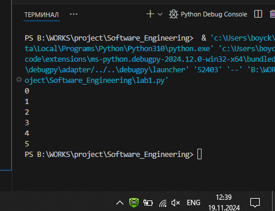
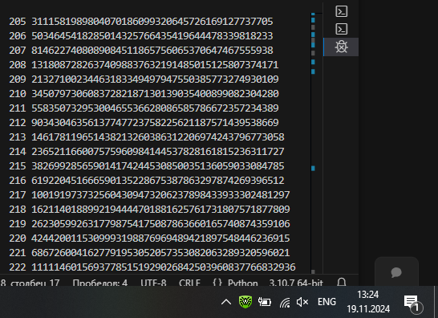

# Тема 7. Работа с файлами (ввод, вывод)
Отчет по Теме #7 выполнил(а):
- Бойков Егор Сергеевич
- ИВТ-22-1

| Задание | Лаб_раб | Сам_раб |
| ------ | ------ | ------ |
| Задание 1 | + | + |
| Задание 2 | + | + |
| Задание 3 | + | + |
| Задание 4 | + | + |
| Задание 5 | + | + |
| Задание 6 | + |  |
| Задание 7 | + |  |
| Задание 8 | + |  |
| Задание 9 | + |  |
| Задание 10 | + |  |

знак "+" - задание выполнено; знак "-" - задание не выполнено;

Работу проверили:
- к.э.н., доцент Панов М.А.

## Лабораторная работа №1
### Составьте текстовый файл и положите его в одну директорию с программой на Python. Текстовый файл должен состоять минимум из двух строк.

### Результат.

## Выводы
Данная лабораторная работа продемонстрировала основные навыки создания и работы с текстовыми файлами
## Лабораторная работа №2
### Напишите программу, которая выведет только первую строку из вашего файла, при этом используйте конструкцию open()/close().

```python
with open("test.txt", "r") as f:
    print(f.readline())
    f.close()
```
### Результат.

## Выводы
 В процессе выполнения работы освоены навыки чтения первой строки файла, используя стандартные методы работы с файлами.
## Лабораторная работа №3
### Напишите программу, которая выведет все строки из вашего файла в массиве, при этом используйте конструкцию open()/close().


```python
f = open("test.txt","r")
print(f.readlines())
f.close()
```
### Результат.

## Выводы
Код выводит все строки файла в виде списка строк с помощью open() и close().

## Лабораторная работа №4
### Напишите программу, которая выведет все строки из вашего файла в массиве, при этом используйте конструкцию with open().


```python
with open("test.txt", "r") as f:
    print(f.readlines())
```
### Результат.


## Выводы
В данном примере показано, как использовать with open() для работы с файлами, выводя их строки в список.

## Лабораторная работа №5
### Напишите программу, которая выведет каждую строку из вашего файла отдельно, при этом используйте конструкцию with open().


```python
with open("test.txt") as f:
    for i in f:
        print(i)
```
### Результат.


## Выводы
Программа выводит каждую строку файла отдельно, используя with open().
## Лабораторная работа №6
### Напишите программу, которая будет добавлять новую строку в ваш файл, а потом выведет полученный файл в консоль. Вывод можно осуществлять любым способом. Обязательно проверьте сам файл, чтобы изменения в нем тоже отображались.

```python
with open("test.txt", "a+") as f:
    f.write("\n Super man")
with open("test.txt", "r") as f:
    print(f.readlines())
```
### Результат.


## Выводы
Программа добавляет новую строку в файл и выводит его содержимое.
## Лабораторная работа №7
### Напишите программу, которая перепишет всю информацию, которая была у вас в файле до этого, например напишет любые данные из произвольно вами составленного списка. Также не забудьте проверить что измененная вами информация сохранилась в файле.

```python
lines = ['one', 'two', 'three']
with open ('test.txt', 'w') as file:
    for line in lines:
        file.write('\nCycle run ' + line)
    print('Готово')
```
### Результат.


## Выводы
Программа перезаписывает файл новыми данными, используя список.
## Лабораторная работа №8
### Выберите любую папку на своем компьютере, имеющую вложенные директории. Выведите на печать в терминал ее содержимое, как и всех подкаталогов при помощи функции print_docs(directory).

```python
import os

def print_docs(directory):
    all_files = os.walk(directory)
    for catalog in all_files:
        print(f'Папка {catalog[0]} содержит: ')
    print(f'Директории: {", ".join([folder for folder in catalog[1]])}')
    print(f'Файлы: {", ".join([file for file in catalog[2]])}')
    print('-' * 40)

print_docs('B:\WORKS\фотки')
```
### Результат.

## Вывод
Программа выводит структуру директорий и файлов для выбранной папки.
## Лабораторная работа №9
### Документ «input.txt» содержит следующий текст:

Приветствие

Спасибо

Извините

Пожалуйста

До свидания

Ты готов?

Как дела?

С днем рождения!

Удача!

Я тебя люблю.

Требуется реализовать функцию, которая выводит слово, имеющее максимальную длину (или список слов, если таковых несколько).

```python
def longest_words(file):
    with open(file, encoding = 'utf-8') as f:
        words = f.read().split()
        sought_words = []
        max_length = len(max(words, key = len))
        for word in words:
            if len(word) == max_length:
                sought_words.append(word)
        if len(sought_words) == 1:
            return sought_words[0]
        return sought_words

print(longest_words('input.txt'))
```
### Результат.


## Выводы
Программа находит самое длинное слово или слова в текстовом файле.
## Лабораторная работа №10
### Требуется создать csv-файл «rows_300.csv» со следующими столбцами:

•	№ - номер по порядку (от 1 до 300);
 
•	Секунда – текущая секунда на вашем ПК;

•	Микросекунда – текущая миллисекунда на часах.

Для наглядности на каждой итерации цикла искусственно приостанавливайте скрипт на 0,01 секунды.

```python
import csv
import datetime
import time

with open('rows_300.csv', 'w', encoding = 'utf-8', newline = '') as f:
    writer = csv.writer(f)
    writer.writerow(['№', 'Секунда', 'Микросекунда'])
    for line in range(1, 301):
        writer.writerow([line, datetime.datetime.now().second,
                         datetime.datetime.now().microsecond])
        time.sleep(0.01)
```
### Результат.


## Выводы
Программа создает CSV-файл с тремя столбцами: порядковый номер, секунда и микросекунда.
## Самостоятельная работа №1
### Найдите в интернете любую статью (объем статьи не менее 200 слов), скопируйте ее содержимое в файл и напишите программу, которая считает количество слов в текстовом файле и определит самое часто встречающееся слово. Результатом выполнения задачи будет: скриншот файла со статьей, листинг кода, и вывод в консоль, в котором будет указана вся необходимая информация.

```python
def analys(F):
    with open(F,"r",encoding="utf-8") as f:
            t = f.read()
            w = t.split()
            count = len(w)
            collection = {}
            for i in w:
                i = i.lower()
                if i in collection:
                    collection[i] += 1
                else:
                    collection[i] = 1

            V = ""
            count_L = 0
            for i, y in collection.items():
                if y > count_L:
                    count_L = y
                    V = i

            print(count , V ,  count_L)
            return 0
print(analys("text.txt"))
```
### Результат.


## Выводы
 Программа считает количество слов в файле и находит самое частое слово.


## Самостоятельная работа №2
### У вас появилась потребность в ведении книги расходов, посмотрев все существующие варианты вы пришли к выводу что вас ничего не устраивает и нужно все делать самому. Напишите программу для учета расходов. Программа должна позволять вводить информацию о расходах, сохранять ее в файл и выводить существующие данные в консоль. Ввод информации происходит через консоль. Результатом выполнения задачи будет: скриншот файла с учетом расходов, листинг кода, и вывод в консоль, с демонстрацией работоспособности программы.

```python
while True:
    print ("1 ввести данные о расходах 2 вывести данные о расходах")
    i = int(input())
    if i == 1:
        with open("buget.txt", 'a', encoding = 'utf-8') as f:
            f.write(input()+"\n")
    elif i ==2:
        with open('buget.txt', 'r', encoding = 'utf-8') as file:
            for line in file:
                print(line)
```
### Результат.


## Выводы
Работа продемонстрировала создание базовой системы учета данных с помощью текстового файла.

## Самостоятельная работа №3
### Имеется файл input.txt с текстом на латинице. Напишите программу, которая выводит следующую статистику по тексту: количество букв латинского алфавита; число слов; число строк.

•	Текст в файле:

Beautiful is better than ugly.

Explicit is better than implicit.

Simple is better than complex.

Complex is better than complicated.

•	Ожидаемый результат: Input file contains:

108 letters

20 words

4 lines

```python
def countW(file):

    with open(file, 'r', encoding='utf-8') as f:
        text = f.read()

    lines = text.count('\n') + 1
    words = len(text.split())
    letters = sum(1 for char in text if char.isalpha())
    print(lines)
    print(words)
    print(letters)

countW('13.txt')
```
### Результат.


## Выводы
Программа подсчитывает количество букв, слов и строк в текстовом файле.
## Самостоятельная работа №4
### Напишите программу, которая получает на вход предложение, выводит его в терминал, заменяя все запрещенные слова звездочками * (количество звездочек равно количеству букв в слове). Запрещенные слова, разделенные символом пробела, хранятся в текстовом файле input.txt. Все слова в этом файле записаны в нижнем регистре. Программа должна заменить запрещенные слова, где бы они ни встречались, даже в середине другого слова. Замена производится независимо от регистра: если файл input.txt содержит запрещенное слово exam, то слова exam, Exam, ExaM, EXAM и exAm должны быть заменены на ****.

•	Запрещенные слова:

hello email python the exam wor is

•	Предложение для проверки:

Hello, world! Python IS the programming language of thE future. My EMAIL is....

PYTHON is awesome!!!!

•	Ожидаемый результат:

*****, ***ld! ****** ** *** programming language of *** future. My ***** **....

****** ** awesome!!!!

```python
def banWords(text,banlist):
    text = text.lower()
    for i in banlist:
        text = text.replace(i,len(i)*"*")
    return text
test = 'Hello, world! Python IS the programming language of thE future. My EMAIL is....\nPYTHON is awesome!!!!'
with open("14.txt", "r") as f:
    ban= f.read().strip().split()
print(banWords(test,ban))
```
### Результат.


## Выводы
 Работа продемонстрировала обработку текста с заменой определенных слов независимо от регистра.
## Самостоятельная работа №5
### Самостоятельно придумайте и решите задачу, которая будет взаимодействовать с текстовым файлом. Задача: на вход в текстовом файле подаются овцы и курицы. посчитать их количество и вывести животное которого больше
```python
def mathAnimal(f):
    with open(f, "r", encoding="utf-8") as f:
        t = f.read()
        w = t.split()
        collection = {}
        for i in w:
            if i in collection:
                    collection[i] += 1
            else:
                    collection[i] = 1
    return max(collection)
print(mathAnimal("15.txt"))
```
### Результат.


## Выводы
 Задача показала применение простых алгоритмов подсчета и сравнения данных в файлах.


## Общие выводы по теме

Лабораторные работы продемонстрировали основные навыки работы с файлами в Python: создание, чтение, запись, а также обработку текста. Тема укрепила понимание использования файлов для хранения данных и их структурирования, что является основой для многих задач в программировании.


