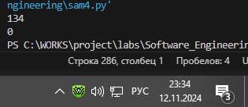

# Тема 9. ООП на Python: концепции, принципы и примеры реализации
Отчет по Теме #8 выполнил(а):
- Бойков Егор Сергеевич
- ИВТ-22-1

| Задание | Лаб_раб | Сам_раб |
| ------ | ------ | ------ |
| Задание 1 | + | + |
| Задание 2 | + | + |
| Задание 3 | + | + |
| Задание 4 | + | + |
| Задание 5 | + | + |

знак "+" - задание выполнено; знак "-" - задание не выполнено;

Работу проверили:
- к.э.н., доцент Панов М.А.

## Лабораторная работа №1
### Допустим, что вы решили оригинально и немного странно познакомится с человеком. Для этого у вас должен быть написан свой класс на Python, который будет проверять угадал ваше имя человек или нет. Для этого создайте класс, указав в свойствах только имя. Дальше создайте функцию __init__(), а в ней сделайте проверку на то угадал человек ваше имя или нет. Также можете проверить что будет, если в этой функции указав атрибут, который не указан в вашем классе, например, попробуйте вызвать фамилию.

```python
class Ivan:
    __slots__ = ['name']
    
    def __init__(self, name):
        if name == 'Иван':
            self.name = f"Да, я {name}"
        else:
            self.name = f"Я не {name}, а Иван"

person1 = Ivan('Паша')
person2 = Ivan('Иван')
print(person1.name)
print(person2.name)

person2.surname = 'Иванов'
```
### Результат.

## Выводы


## Лабораторная работа №2
### Вам дали важное задание, написать продавцу мороженого программу, которая будет писать добавили ли топпинг в мороженое и цену после возможного изменения. Для этого вам нужно написать класс, в котором будет определяться изменили ли состав мороженого или нет. В этом классе  реализуйте  метод,  выводящий  на  печать  «Мороженое  с {ТОППИНГ}» в случае наличия добавки, а иначе отобразится следующая фраза: «Обычное мороженое». При этом программа должна воспринимать как топпинг только атрибуты типа string.

```python
class Icecream:
    def __init__(self, ingredient=None):
        if isinstance(ingredient, str):
            self.ingredient = ingredient
        else:
            self.ingredient = None

    def composition(self):
        if self.ingredient:
            print(f"Мороженое с {self.ingredient}")
        else:
            print('Обычное мороженое')

icecream = Icecream()
icecream.composition()
icecream = Icecream('шоколадом')
icecream.composition()
icecream = Icecream(3)
icecream.composition()
```
### Результат.

## Выводы


## Лабораторная работа №3
### Петя – начинающий программист и на занятиях ему сказали реализовать икапсу…что-то. А вы хороший друг Пети и ко всему прочему прекрасно знаете, что икапсу…что-то – это инкапсуляция, поэтому решаете помочь вашему другу с написанием класса с инкапсуляцией. Ваш класс будет не просто инкапсуляцией, а классом с сеттером, геттером и деструктором. После написания класса вам необходимо продемонстрировать что все написанные вами функции работают. Также вам необходимо объяснить Пете почему на скриншоте ниже в консоли выводится ошибка.

```python
class MyClass:
    def __init__(self, value):
        self._value = value

    def set_value(self, value): #Установка значения атрибута
        self._value = value

    def get_value(self): #Получение значения атрибута
        return self._value

    def del_value(self): #Удаление атрибута
        del self._value

    value = property(get_value, set_value, del_value, "Свойство value")

example = MyClass(30)
print(example.get_value())
example.set_value(50)
print(example.get_value())
example.set_value(100)
print(example.get_value())
example.del_value()
# вызов удалёного атрибута
print(example.get_value())

```
### Результат.

## Выводы


## Лабораторная работа №4
### Реализуйте инкапсуляцию для класса, созданного в первом задании. Создайте защищенный атрибут производителя и приватный атрибут модели. Вызовите защищенный атрибут и заставьте машину поехать. Напишите комментарии для кода, объясняющие его работу. Результатом выполнения задания будет листинг кода с комментариями и получившийся вывод в консоль.


```python
# Определение класса Car, представляющего автомобиль
class Car:
    # Инициализация объекта класса Car с атрибутами make и model
    def __init__(self, make, model):
        self._make = make         # Защищённый (protected) атрибут make, доступен внутри класса и для наследников
        self.__model = model      # Приватный (private) атрибут model, доступен только внутри этого класса

    # Метод drive, который выводит сообщение о том, что автомобиль едет
    def drive(self):
        print(f"Driving the {self._make} {self.__model}")  # Доступ к защищённому и приватному атрибутам внутри класса

# Создание объекта класса Car с маркой "mak" и моделью "II"
my_car = Car("mak", "II")

# Доступ к защищённому атрибуту _make вне класса допустим, но рекомендуется избегать его прямого изменения
print(my_car._make)

# Попытка доступа к приватному атрибуту __model вызовет ошибку, так как он скрыт от внешнего доступа
# print(my_car.__model)  # Раскомментировав, получим ошибку AttributeError

# Вызов метода drive для объекта my_car
my_car.drive()

```
### Результат.


## Выводы
Реализована инкапсуляция: добавлены защищённые и приватные атрибуты, что ограничивает доступ к данным. Это закрепило знания об уровнях доступа к атрибутам и важности защиты данных внутри классов.


## Лабораторная работа №5
### Реализуйте полиморфизм создав основной (общий) класс “Shape”, а также еще два класса “Rectangle” и “Circle”. Внутри последних двух классов реализуйте методы для подсчета площади фигуры. После этого создайте массив с фигурами, поместите туда круг и прямоугольник, затем при помощи цикла выведите их площади. Напишите комментарии для кода, объясняющие его работу. Результатом выполнения задания будет листинг кода с комментариями и получившийся вывод в консоль.


```python
# Определение базового класса Shape, представляющего общую форму
class Shape:
    # Метод area, который должен быть определён в подклассах
    def area(self):
        pass  # Пустой метод, который переопределяется в дочерних классах

# Определение класса Rectangle, наследующего Shape
class Rectangle(Shape):
    # Инициализация объекта класса Rectangle с параметрами ширины и высоты
    def __init__(self, width, height):
        self.width = width    # Ширина прямоугольника
        self.height = height  # Высота прямоугольника

    # Переопределение метода area для вычисления площади прямоугольника
    def area(self):
        return self.width * self.height  # Площадь прямоугольника = ширина * высота

# Определение класса Circle, наследующего Shape
class Circle(Shape):
    # Инициализация объекта класса Circle с параметром радиуса
    def __init__(self, radius):
        self.radius = radius  # Радиус круга

    # Переопределение метода area для вычисления площади круга
    def area(self):
        return 3.14 * self.radius * self.radius  # Площадь круга = π * радиус^2

# Создание списка фигур, содержащего экземпляры Rectangle и Circle
arr = [Rectangle(12, 67), Circle(41)]

# Перебор элементов списка и вывод площади каждой фигуры
for elem in arr:
    print(elem.area())  # Вызов метода area для каждого объекта в списке

```
### Результат.


## Выводы
Создан полиморфный класс Shape с дочерними классами Rectangle и Circle, каждый из которых имеет собственную реализацию метода area. Полиморфизм позволил вызвать метод area для объектов разных классов, что подтвердило возможность гибкого использования классов с одинаковыми методами, но различной реализацией.


## Самостоятельная работа №1
### Самостоятельно создайте класс и его объект. Они должны отличаться, от тех, что указаны в теоретическом материале (методичке) и лабораторных заданиях. Результатом выполнения задания будет листинг кода и получившийся вывод консоли.

```python
class Animal:
    def __init__(self,name, zzz):
        self.name = name
        self.zzz = zzz
    def sayName(self):
        print(f"Меня ховут {self.name}")
    def sound(self):
        print(self.zzz)
M = Animal("Корова","муму")
M.sayName()
M.sound()
```
### Результат.


## Выводы
В данной работе был создан класс Animal с атрибутами имени и звука, а также методами для их отображения. Это позволило закрепить навыки создания и инициализации собственных классов и объектов, а также взаимодействия с атрибутами и методами.


## Самостоятельная работа №2
### Самостоятельно создайте атрибуты и методы для ранее созданного класса. Они должны отличаться, от тех, что указаны в теоретическом материале (методичке) и лабораторных заданиях. Результатом выполнения задания будет листинг кода и получившийся вывод консоли.

```python
class Animal:
    def __init__(self,name, zzz):
        self.name = name
        self.zzz = zzz
    def sayName(self):
        print(f"Меня ховут {self.name}")
    def sound(self):
        print(self.zzz)
    def go(self):
        print("топ топ")
M = Animal("Корова","муму")
M.sayName()
M.sound()
M.go()
```
### Результат.


## Выводы
Добавлены новые атрибуты и методы к классу Animal, что расширило функционал и дало возможность объектам выполнять дополнительные действия. Эта работа позволила лучше понять принципы добавления новых свойств к уже существующим классам и методам.


## Самостоятельная работа №3
### Самостоятельно реализуйте наследование, продолжая работать с ранее созданным классом. Оно должно отличаться, от того, что указано в теоретическом материале (методичке) и лабораторных заданиях. Результатом выполнения задания будет листинг кода и получившийся вывод консоли.

```python
class Animal:
    def __init__(self,name, zzz):
        self.name = name
        self.zzz = zzz
    def sayName(self):
        print(f"Меня ховут {self.name}")
    def sound(self):
        print(self.zzz)
    def go(self):
        print("топ топ")
class dog(Animal):
    def __init__(self,name,zzz):
        super().__init__(name,zzz)
        
M = Animal("Корова","муму")
D = dog("Собака", "гав гав")
D.sound()
```
### Результат.


## Выводы
Реализовано наследование с созданием класса dog, унаследовавшего свойства и методы от Animal. Это закрепило навыки наследования, показав, как можно использовать и расширять базовый класс, создавая более специфичные подклассы.


## Самостоятельная работа №4
### Самостоятельно реализуйте инкапсуляцию, продолжая работать с ранее созданным классом. Она должна отличаться, от того, что указана в теоретическом материале (методичке) и лабораторных заданиях. Результатом выполнения задания будет листинг кода и получившийся вывод консоли.

```python
class Animal:
    def __init__(self,name, zzz):
        self._name = name
        self.__zzz = zzz
    def sayName(self):
        print(f"Меня ховут {self._name}")
    def sound(self):
        print(self.__zzz)
    def go(self):
        print("топ топ")
class dog(Animal):
    def __init__(self,name,zzz):
        super().__init__(name,zzz)
        
M = Animal("Корова","муму")
D = dog("Собака", "гав гав")
D.sound()
```
### Результат.


## Выводы
Была реализована инкапсуляция с использованием защищённых и приватных атрибутов, что ограничивает доступ к данным. Задание помогло усвоить различия между уровнями доступа к данным и важность защиты информации внутри классов.


## Самостоятельная работа №5
### Самостоятельно реализуйте полиморфизм. Он должен отличаться, от того, что указан в теоретическом материале (методичке) и лабораторных заданиях. Результатом выполнения задания будет листинг кода и получившийся вывод консоли.

```python
class Animal:
    def __init__(self,name, zzz):
        self._name = name
        self.__zzz = zzz
    def sayName(self):
        print(f"Меня ховут {self._name}")
    def sound(self):
        print(self.__zzz)
    def go(self):
        print("топ топ")
class dog(Animal):
    def __init__(self,name,zzz):
        super().__init__(name,zzz)
    def go(self):
        print("прыг скок")
        
M = Animal("Корова","муму")
D = dog("Собака", "гав гав")
D.sound()
D.go()
```
### Результат.


## Выводы
В классе-наследнике dog был переопределён метод go, демонстрируя полиморфизм в действии. Это позволило увидеть, как можно изменять поведение методов в дочерних классах, что добавляет гибкости и позволяет адаптировать функциональность под разные нужды.

## Общие выводы по теме
В ходе выполнения всех заданий были изучены и успешно применены ключевые концепции объектно-ориентированного программирования: инкапсуляция, наследование, полиморфизм и работа с классами. Это заложило фундамент для создания структурированного и гибкого кода, а также позволило понять, как использовать основные принципы ООП для решения различных задач в программировании.


